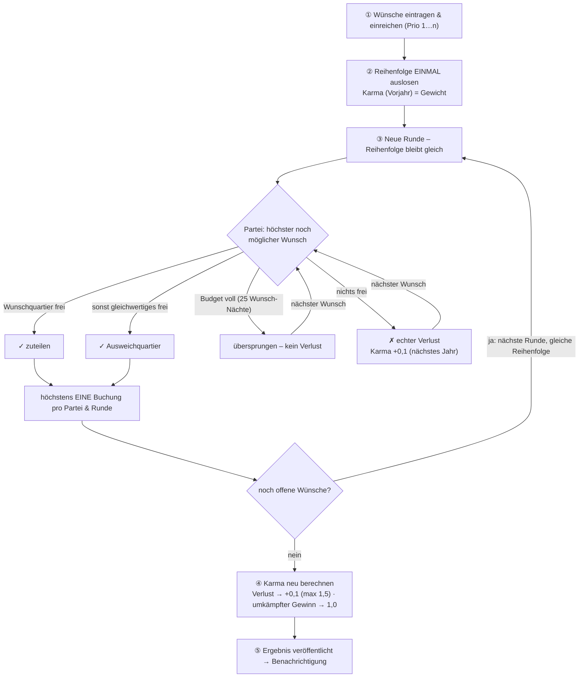

# Re:Hof Quartier-Buchung (PoC)

Buchungs- und Losverfahren für die Ferienquartiere der Genossenschaft, inklusive
Mitgliedermanagement. Diese PoC enthält das fachlich abgenommene Losverfahren als
getestetes, eigenständiges Python-Modul und eine schlanke Django-Oberfläche
darum herum.

> **Status:** lauffähige Proof-of-Concept. Getestet auf zwei Ebenen –
> **reine Logik** (Losverfahren inkl. deterministischem Strategiesicherheits-
> Beweis, Verfügbarkeit, Regeln) und **Integration** (DB-Ebene: Buchung,
> Losung-Workflow, Dashboard, Hofladen, Kontoabgleich). Backup & weiteres
> Hardening sind als Blueprint vorbereitet (`docs/BETRIEB-SICHERHEIT.md`).

---

## Schnellstart auf dem VPS

Voraussetzung: ein Linux-Server (Debian/Ubuntu), auf dem bereits **Caddy** läuft.
Docker/Compose/git werden vom Install-Skript bei Bedarf installiert.

```bash
git clone <dein-privates-repo> rehof
cd rehof

# 1) Voraussetzungen prüfen/installieren, .env mit Zufalls-Geheimnissen anlegen
./install.sh

# 2) In .env die Domain eintragen:
#    ALLOWED_HOSTS=quartiere.deine-domain.de
#    CSRF_TRUSTED_ORIGINS=https://quartiere.deine-domain.de

# 3) Stack bauen & starten (optional gleich mit Demo-Daten: --seed)
./install.sh --start
#   bzw.   ./install.sh --seed

# 4) Admin-Konto anlegen
docker compose exec web python manage.py createsuperuser
```

Danach den Caddy-Block aus `caddy/Caddyfile.snippet` in dein Host-Caddyfile
übernehmen (Domain anpassen) und Caddy neu laden:

```bash
sudo systemctl reload caddy
```

Caddy holt das TLS-Zertifikat automatisch und proxyt auf `127.0.0.1:8000`
(der Web-Container ist bewusst nur an localhost gebunden).

---

## Test-Anleitung (POC)

Ziel: in wenigen Minuten **zwei Rollen** ausprobieren – eine:n **Verwalter:in**
(Staff) und eine:n **Testnutzer:in** (Mitglied).

### 1) Daten & Konten anlegen

Am schnellsten mit Demo-Daten (echte Quartiere, Perioden, ein paar Mitglieder):

```bash
docker compose exec web python manage.py seed_demo --reset   # Demo-Stammdaten
docker compose exec web python manage.py createsuperuser     # Verwalter:in (Staff)
```

- **Verwalter:in** = das Superuser-Konto. Es ist `is_staff` und sieht in der
  Navigation zusätzlich **Verwaltung** (Dashboard) und **Backend** (Django-Admin).
- **Testnutzer:in** = ein Demo-Mitglied, z. B. Login `anna0`, Passwort
  `demo12345` (nach `seed_demo`).

**Ohne Demo-Daten** (manuell): Testnutzer:in unter `…/registrieren/` selbst
anlegen → dann als Verwalter:in im **Backend** ein **Mitglieds-Profil** zuordnen
(Benutzer → „Mitglieds-Profil“) und einen **Mitglieds-Anteil** mit Tage-Budget
anlegen (Mitglieds-Anteile → Anteil + Nutzer mit z. B. 50/25 Tagen). Erst dann
ist das Konto freigeschaltet und kann buchen.

> Tipp: Damit die Auslosung etwas zu verteilen hat, muss eine **Buchungsperiode**
> fürs Folgejahr existieren (Demo legt das an) und es müssen **eingereichte**
> Wünsche vorliegen.

### 2) Als Verwalter:in testen (Nav: „Verwaltung“ + „Backend“)

- **Backend** (`/admin/`): Quartiere & Äquivalenzklassen, **Buchungsregeln**
  (Mindestnächte/Saison), **Buchungsperiode** mit Terminen anlegen;
  **Betriebs-Einstellungen** (Empfänger der Verwaltungs-Mails) und
  **Hofladen-Einstellungen** (IBAN, Zahlungsziel) pflegen.
- **Losung**: Buchungsperioden → Aktion **„Losung durchführen“** → Ergebnis ist
  zunächst **unbestätigt**; unter **Losdurchläufe** **bestätigen** (veröffentlicht +
  benachrichtigt) oder **zurücknehmen**.
- **Dashboard** (`/verwaltung/`): Reinigungsliste (Export/Versand), anstehende
  Buchungen (Export/Versand), **Rechnungen** (Filter offen/überfällig/alle,
  „überfällige erinnern“, Export) und **Kontoabgleich** (Test-CSV hochladen –
  Rechnungsnummer im Verwendungszweck + passender Betrag wird automatisch
  verbucht).

### 3) Als Testnutzer:in testen

- **Übersicht**: einen Tag anklicken → wer ist da, was ist frei.
- **Buchen**: Personen einstellen, im Ampel-Kalender An-/Abreise klicken, Quartier
  wählen, optional **Endreinigung** mitbuchen; ist alles belegt → **Warteliste**.
- **Wunschliste**: Wünsche fürs Folgejahr eintragen, priorisieren, **einreichen**.
  Nach der (bestätigten) Losung das Ergebnis unter **Meine Buchungen** sehen.
- **Meine Buchungen**: stornieren; **Wechselwunsch** an ein anderes Mitglied.
- **Tage übertragen**: ein paar Tage an ein anderes Mitglied abgeben.
- **Hofladen**: etwas in den Warenkorb, **Kasse**, **Rechnung** ansehen, **PDF**
  herunterladen, „habe ich bezahlt“ melden.
- **Profil**: Anschrift/IBAN pflegen, E-Mail-Benachrichtigungen an/aus.
- **Installieren**: im mobilen Browser „Zum Startbildschirm hinzufügen“.

E-Mails landen ohne konfiguriertes `EMAIL_HOST` im Container-Log
(`docker compose logs web`), sodass sich der Versand auch ohne echten
Mailserver nachvollziehen lässt.

---

## Was die PoC kann (Kurzüberblick)

**Für Mitglieder (Web-App, auch als PWA aufs Handy installierbar):**
Community-**Übersicht** (wer ist wann wo), **Buchen** über einen Ampel-Kalender
inkl. Spontanbuchung und **Warteliste**, **Wunschliste + faires Losverfahren**
fürs Folgejahr, **Meine Buchungen** mit Storno und **Wechselwunsch**, **Tage
übertragen**, **Hofladen** mit monatlicher Sammelrechnung und **Rechnungs-PDF**,
**Profil** (Anschrift/IBAN/E-Mail-Opt-out). **Benachrichtigungen** in-App und per
E-Mail.

**Für die Verwaltung:** Django-**Backend** (Mitglieder/Anteile, Quartiere,
Äquivalenzklassen, Buchungsregeln, Perioden) + ein operatives **Dashboard**
(`/verwaltung/`): Reinigungsliste, anstehende Buchungen, Rechnungen (filterbar,
Mahnen per Knopf, Export), **Kontoabgleich** (Auszug importieren → Rechnungen
automatisch verbuchen). **Losung** mit Bestätigungs-/Rücknahme-Workflow.
Ein **Scheduler** erledigt Cron-Aufgaben (fällige Losungen, Monatsrechnungen,
E-Mail-Versand, Monats-Mail an die Verwaltung).

Die vollständige Feature-Liste **mit Datei/Funktion** steht unter
[Funktionsüberblick](#funktionsüberblick); eine Schritt-für-Schritt-Anleitung
zum Ausprobieren unter [Test-Anleitung](#test-anleitung-poc).

Demo-Login nach `--seed`: Benutzername z.B. `anna0`, Passwort `demo12345`.

---

## Buchungszeiträume & Tage (Zeitlogik)

Die PoC unterscheidet bewusst zwei Zeitachsen:

- **Normale Buchung** ist nur in **freigeschalteten Buchungszeiträumen** möglich
  (üblicherweise das laufende Jahr). Der Admin legt diese unter
  **Buchungszeiträume** fest:
  - **global** (Haken „Gilt für alle Quartiere") – die Grundfreigabe, und
  - **enger für eine Teilmenge** – ein nicht-globales Fenster mit ausgewählten
    Quartieren schränkt deren Buchbarkeit weiter ein.
  - **Semantik (Schnittmenge):** Buchbar ist ein Tag nur, wenn er *sowohl*
    global *als auch* – falls für das Quartier ein spezifisches Fenster
    existiert – in diesem freigegeben ist. Spezifische Fenster können also nur
    weiter einschränken, nie über die globale Freigabe hinaus erweitern.
    (Beispiel im Seed: Pfarrhäuser nur Mai–September.)
- **Das Losverfahren** läuft typischerweise im Sommer für das **nächste Jahr**,
  dessen Buchungszeitraum noch **nicht** freigeschaltet ist. Es ist daher
  bewusst **unabhängig** von den Buchungszeiträumen und vergibt die Slots im
  Voraus.

**Verfügbare Tage:** Jedes Mitglied hat ein Jahreskontingent (Standard 50, davon
max. 25 über die Wunschliste/Losung). Tage werden **nicht** ins Folgejahr
übertragen – das Kontingent gilt je Kalenderjahr frisch. Tage können aber
**an andere Mitglieder übertragen** werden (Seite „Tage übertragen"); die
verfügbaren Tage ergeben sich aus Kontingent + erhaltene − abgegebene −
verbrauchte Tage.

---

## Buchungsregeln (im Admin konfigurierbar)

Zwei Admin-Bereiche steuern die Regeln; die Prüfung greift bei jeder normalen
Buchung:

- **Buchungsregel (global):** die Standard-Mindestbuchung (Default 3 Nächte).
- **Saison-Regeln:** beliebig viele Zeiträume mit je optional
  - **Mindestnächte** (z.B. Juli/August = 7),
  - **max. gleichzeitige Wohneinheiten** je Mitglied (z.B. Schulferien und
    Feiertage wie Weihnachten/Silvester, Ostern, Himmelfahrt, Pfingsten = 2),
  - **Aufenthaltsdeckel** je Partei in Einheiten-Nächten (z.B. Berlin/
    Brandenburg-Sommerferien = 14, also „zwei Wochen eine Einheit ODER eine
    Woche zwei Einheiten"). Die zwei Wochen müssen nicht am Stück liegen.

Außerhalb der hinterlegten Sonderzeiträume gibt es kein Parallel-Limit. Die
konkreten Termine (Schulferien, Brückentage, bewegliche Feiertage) verschieben
sich jährlich und werden im Admin gepflegt; der Seed legt die realen
Berlin/Brandenburg-Termine des laufenden Jahres als Startpunkt an (Berlin und
Brandenburg sind nahezu identisch).

> Hinweis: Diese Regeln werden bei der **normalen Buchung** geprüft. Für die
> **Losung** (die das Folgejahr im Voraus vergibt) sind sie als Ausbaustufe
> vorgesehen – die Prüflogik (`booking/rules.py`) ist bereits so gekapselt,
> dass sie sich dort einhängen lässt.

---

## Das Losverfahren in Kürze

Verfahren: **gewichtete Zufallsreihenfolge im Runden-Prinzip** (fachlich eine
„weighted random serial dictatorship" mit Ausweich-Logik und Mehrjahres-Ausgleich).

- **Reihenfolge – genau einmal:** Zu Beginn wird *eine* gewichtete Reihenfolge
  aller Teilnehmenden gezogen. Sie gilt für **alle Runden** und wird **nicht**
  jede Runde neu gezogen. Über einen Seed ist jede Ziehung reproduzierbar.
- **Karma als Gewicht:** Ein höherer Ausgleichsfaktor (aus früheren Verlusten)
  bringt in *dieser einen Ziehung* tendenziell einen vorderen Platz. Karma fließt
  also als **Gewicht in die Ziehung** ein – und wird **erst am Ende neu
  berechnet**, für die *nächste* Losung (nicht zwischen den Runden).
- **Runden-Prinzip:** In Runde 1 bekommt jede Partei – in der gelosten Reihenfolge
  – ihren *höchsten noch möglichen* Wunsch, in Runde 2 mit *derselben* Reihenfolge
  den nächsten, usw. Pro Runde höchstens **eine** Buchung je Partei – so werden
  knappe Premium-Termine (z.B. Pfingsten) gleichmäßiger verteilt.
- **Ausweichen:** Ist das konkrete Wunschquartier belegt, wird ein
  **gleichwertiges** Quartier derselben Äquivalenzklasse zugeteilt, bevor ein
  echter Verlust entsteht.
- **Karma-Update (am Ende):** Wer einen Zeitraum *echt* verliert (in der ganzen
  Klasse nichts frei), bekommt für die nächste Losung +0,1 (gedeckelt 1,5). Wer
  einen *umkämpften* Slot gewinnt, wird auf 1,0 zurückgesetzt. Budget-bedingtes
  Aussetzen zählt **nicht** als Verlust.
- **Strategiesicher:** Die Wunschliste bestimmt nur, *was* man nimmt, wenn man
  dran ist – nicht *wann*. Ehrliches Angeben ist nachweislich nie schlechter als
  Tricksen (siehe Test `test_strategieproof_ueber_alle_reihenfolgen`).

### Reihenfolge & Karma (wie die Ziehung statistisch funktioniert)

Die Reihenfolge ist eine **gewichtete Zufalls-Permutation** nach dem
**Efraimidis–Spirakis-Verfahren** (gewichtete Zufallsstichprobe ohne
Zurücklegen, `booking/lottery.py::weighted_random_order`). Jede Partei erhält
einen Schlüssel

$$k = u^{1/g}, \qquad u \sim \mathcal{U}(0,1)$$

mit dem **Karma-Gewicht** $g$ (Start 1,0). Absteigend nach $k$ sortiert ergibt
sich die Reihenfolge; ein höheres $g$ schiebt $k$ näher an 1 (tendenziell weiter
vorn, nie garantiert). Die Wahrscheinlichkeit, **Erste:r** zu werden, ist exakt
gewichtsproportional:

$$P(\text{Partei } i \text{ ist vorn}) = \frac{g_i}{\sum_{j} g_j}$$

Beispiel: Karma 1,5 gegen vier mit je 1,0 → $1{,}5/5{,}5 \approx 27\,\%$ (statt
18 % bei gleichem Karma). $g$ steigt um **+0,1** je Jahr mit echtem Verlust
(Deckel **1,5**) und wird nach Gewinn eines umkämpften Slots auf **1,0**
zurückgesetzt. Pech verschiebt also die Wahrscheinlichkeiten zu deinen Gunsten,
ersetzt aber nie den Zufall.

### Strategiesicherheit (was das heißt und wie es sichergestellt ist)

**Strategiesicher** heißt: keine Falschangabe bringt im Erwartungswert ein
besseres Ergebnis als die ehrlichen, nach echter Wichtigkeit sortierten Wünsche –
ehrlich angeben ist die **dominante Strategie**. Es ist eine **(gewichtete)
zufällige serielle Diktatur**: die **Reihenfolge hängt nur von Karma und Zufall
ab, nicht von der Wunschliste** (man kann das *Wann* nicht beeinflussen), und wer
dran ist, nimmt den höchsten noch freien Wunsch (das *Was*). Den am meisten
gewünschten freien Slot zu nehmen ist per Definition optimal; eine andere
Reihenfolge anzugeben kann nur zu etwas weniger Gewünschtem führen. Belegt wird
das durch `tests/test_lottery.py::test_strategieproof_ueber_alle_reihenfolgen`,
der über **alle** möglichen Reihenfolgen nachrechnet.

### Budgets & Wünsche (bewusst entkoppelt)

Es gibt **zwei** Budgets: **50 Tage/Jahr gesamt** (Losung + normale Buchung) und
davon höchstens **25 über die Losung** (`Member.wish_night_budget`). Das **Eintragen
von Wünschen ist NICHT begrenzt** – man darf mehr als 25 Nächte an Wünschen
einreichen. Die Losung vergibt aber höchstens 25 Wunsch-Nächte: ist die Grenze
erreicht, werden weitere Wünsche **übersprungen** (`budget_skip` in
`lottery.run_lottery`) – das ist *kein* Verlust und kostet kein Karma. „Viele
Wünsche eintragen" ist daher **kein Vorteil über das ehrliche Angeben hinaus**:
die Position in der Reihenfolge ändert sich nicht, und die 25-Nächte-Grenze
deckelt die Gesamt-Zuteilung. (Eine Obergrenze für die *Anzahl* eingetragener
Wünsche ist bewusst nicht gesetzt – falls die Genossenschaft das wünscht, ließe
sich das in `services.add_wish` ergänzen.)

### Ablauf



### Beispiel: 5 Mitglieder, je 2 Wünsche

*Salix* und *Lupulus* sind **gleichwertig** (Gruppe „Gartenhäuser“), das
*Pfarrhaus* steht allein. Begehrt: **Pfingsten** (3 Nächte) und eine
**Sommerwoche** (7 Nächte). **Karma vorab:** Dora 1,2 (ging letztes Jahr leer
aus), alle anderen 1,0.

| Mitglied | ① Erstwunsch        | ② Zweitwunsch        |
|----------|---------------------|----------------------|
| Anna     | Salix · Pfingsten   | Pfarrhaus · Sommer   |
| Ben      | Lupulus · Pfingsten | Salix · Sommer       |
| Cem      | Salix · Pfingsten   | Pfarrhaus · Sommer   |
| Dora     | Pfarrhaus · Pfingsten | Salix · Sommer     |
| Eva      | Salix · Pfingsten   | Lupulus · Pfingsten  |

Dank Karma landet Dora wahrscheinlich vorn. Angenommen, die (eine!) Ziehung
ergibt **Dora ▸ Anna ▸ Ben ▸ Cem ▸ Eva**.

**Runde 1** – höchster noch möglicher Wunsch je Partei:
- **Dora** → Pfarrhaus · Pfingsten ✓ (kein anderer will Pfarrhaus zu Pfingsten → nicht umkämpft)
- **Anna** → Salix · Pfingsten ✓ (umkämpft)
- **Ben** → Lupulus · Pfingsten ✓ (umkämpft)
- **Cem** → Salix & Lupulus belegt → *Verlust*; Zweitwunsch Pfarrhaus · Sommer ✓ (umkämpft mit Anna)
- **Eva** → Salix & Lupulus belegt → *Verlust*; Zweitwunsch Lupulus · Pfingsten ebenfalls belegt → *Verlust*; keine Buchung

**Runde 2** – gleiche Reihenfolge; nur Dora, Anna, Ben haben offene Wünsche:
- **Dora** → Salix · Sommer ✓ (umkämpft mit Ben)
- **Anna** → Pfarrhaus · Sommer belegt (Cem) → *Verlust*
- **Ben** → Salix · Sommer belegt (Dora) → Ausweich **Lupulus · Sommer** ✓

**Ergebnis & neues Karma** (fürs *nächste* Jahr):

| Mitglied | Bekommen                                   | Karma neu                                  |
|----------|--------------------------------------------|--------------------------------------------|
| Anna     | Salix · Pfingsten                          | 1,0 → **1,1** (Verlust Sommer)             |
| Ben      | Lupulus · Pfingsten + Lupulus · Sommer     | 1,0 (umkämpft gewonnen)                    |
| Cem      | Pfarrhaus · Sommer                         | 1,0 → **1,1** (Verlust Pfingsten)          |
| Dora     | Pfarrhaus · Pfingsten + Salix · Sommer     | 1,2 → **1,0** (umkämpft gewonnen → Reset)  |
| Eva      | — (leer ausgegangen)                       | 1,0 → **1,1** (Verlust)                     |

Eva geht dieses Jahr leer aus, bekommt aber +0,1 Karma und damit nächstes Jahr
eine bessere Ausgangsposition; Dora hat ihren Vorsprung „eingelöst“ und startet
wieder bei 1,0. So bleibt es über die Jahre fair.

Das Verfahren ist im Detail in `Losverfahren-Spezifikation.md` beschrieben
(Genossenschafts-Vorlage und Bauplan zugleich).

---

## Funktionsüberblick

Alle Features mit funktionaler Kurzbeschreibung und der Stelle im Code
(Datei · Funktion/Klasse). Architektur-Prinzip: **reine Logik** (`lottery.py`,
`availability.py`, `rules.py`, ohne Django) ↔ **Service-Layer** (`services.py`,
Brücke DB↔Logik) ↔ **dünne Views/Templates**.

### Für Mitglieder

| Funktion | Funktional (was es tut) | Technik (Datei · Funktion/Klasse) |
|---|---|---|
| Übersicht | Community-Monatskalender; Klick auf einen Tag zeigt, wer da ist und was frei ist | `booking/views.py::overview` · `services.build_community_calendar`, `day_detail` |
| Buchen / Spontanbuchung | Ampel-Kalender, Quartierwahl nach Personen/Barrierefreiheit, Mindestnächte-Hinweis, Bestätigungsschritt | `views.py::book`, `book_confirm` · `services.book_spontaneous`, `split_quarters_for_range`, `range_is_released`, `min_nights_for_range` |
| Warteliste | Auf belegten Zeitraum warten; Benachrichtigung, sobald frei | `services.add_waitlist_entry`, `notify_waitlist_if_free` · `models.WaitlistEntry` |
| Wunschliste | Wünsche fürs Folgejahr eintragen, priorisieren (Drag/Pfeiltasten), einreichen | `views.py::wishlist` · `services.add_wish`, `move_wish`, `submit_wishlist`, `build_wish_calendar` · `models.Wish` |
| Losverfahren | Gewichtete Ziehung, Runden-Prinzip, Ausweichquartiere, Karma | `booking/lottery.py::run_lottery`, `weighted_random_order` · `services.run_period_lottery` |
| Ergebnis-/Auditansicht | Eigenes Ergebnis + Gemeinschafts-Zuteilungen + (Staff) Protokoll | `views.py::period_result` · `lottery.render_log_text` |
| Meine Buchungen / Storno | Eigene Buchungen sehen und stornieren (mit Rückfrage) | `views.py::my_bookings` · `services.cancel_allocation` |
| Wechselwunsch | Quartiertausch an ein anderes Mitglied anfragen, zustimmen/ablehnen | `services` (Wechselwunsch) · `models.SwapRequest` |
| Tage übertragen | Eigene Tage an ein anderes Mitglied abgeben (zweistufig) | `views.py::transfer` · `services.transfer_nights` · `models.NightTransfer` |
| Profil | Anschrift/IBAN + E-Mail-Opt-out selbst pflegen | `views.py::profile` · `forms.ProfileForm` |
| Registrierung & Freischaltung | Selbst registrieren; bis Profil-Zuordnung gesperrt (Warteseite) | `views.py::register`, `pending` · `middleware.ActivationGateMiddleware` · `auth.EmailOrUsernameModelBackend` |
| Benachrichtigungen | In-App **und** E-Mail (Opt-out je Mitglied) | `models.Notification`, `OutboxEmail` · `services.email_member` · `commands/send_outbox.py` |
| Hofladen | Warenkorb → Kasse → Einkauf; gleiche Artikel zusammengefasst | `shop/services.py::add_item`, `set_cart_quantity`, `checkout` · `shop/models.py::LineItem`, `Purchase` |
| Rechnung + PDF | Monatliche/sofortige Sammelrechnung (§14), PDF, „bezahlt“ melden | `shop/services.py::generate_monthly_invoices`, `generate_invoice_now`, `mark_paid` · `shop/pdf.py` · `shop/views.py::invoice_pdf` |
| PWA / Mobil | Installierbar, offline-Fallback, responsive Navigation (untere Tab-Leiste) | `templates/booking/base.html`, `templates/booking/sw.js`, `static/booking/manifest.webmanifest` |

### Für die Verwaltung

| Funktion | Funktional | Technik |
|---|---|---|
| Dashboard | Operative Seite (nur Staff): Kennzahlen + Arbeitslisten | `booking/views.py::dashboard` (Gate `_staff_required`) |
| Reinigungsliste | Abreisen = Reinigungstage, Filter „Endreinigung“, Export, Versand ans Team | `services.departures_in_range`, `_annotate_cleaning`, `cleaning_rows`, `email_cleaning` |
| Anstehende Buchungen | Monatsliste, Export, Versand an die Verwaltung | `services.arrivals_in_range`, `booking_rows`, `email_admins` |
| Export (xlsx/CSV) | Listen als Excel **und** CSV | `booking/exports.py::xlsx_response`, `csv_response` |
| Rechnungen verwalten | Fälligkeit/Überfälligkeit, Filter, **Mahnen per Knopf**, Export | `shop/services.py::overdue_invoices`, `send_payment_reminder`, `remind_overdue` · `shop/admin.py::InvoiceAdmin` |
| Kontoabgleich | Auszug (CSV/CAMT) importieren → eindeutige Treffer automatisch verbuchen + benachrichtigen | `shop/bankimport.py::parse_csv/parse_camt` · `shop/reconcile.py::import_bank_statement`, `book_payment` |
| Losung steuern | Durchführen, **bestätigen** (veröffentlichen), **zurücknehmen** | `services.confirm_lottery`, `rollback_lottery` · `admin.BookingPeriodAdmin`, `LotteryRunAdmin` |
| Stammdaten & Regeln | Mitglieder/Anteile, Quartiere, Saison-Regeln, Perioden | `booking/admin.py`, `shop/admin.py` |
| Betriebs-Einstellungen | Empfänger der Verwaltungs-Mails, Monats-Mail-Tag, Zahlungsziel | `models.OpsConfig`, `shop/models.py::ShopConfig` |

### Betrieb (Scheduler/Cron) & reine Logik

| Funktion | Technik |
|---|---|
| Hintergrund-Scheduler (Cron-Ersatz) | `commands/run_scheduler.py` |
| Fällige Losungen + Status-Schaltung | `commands/run_due_lotteries.py` · `BookingPeriod.compute_status` |
| Monatsrechnungen | `commands/run_monthly_invoices.py` |
| E-Mail-Versand (Outbox leeren, mit Anhängen) | `commands/send_outbox.py` |
| Monats-Mail an die Verwaltung | `commands/notify_admins_upcoming.py` · `services.notify_admins_upcoming` |
| Losalgorithmus (rein, ohne DB) | `booking/lottery.py` |
| Verfügbarkeit & Tage-Rechnung (rein) | `booking/availability.py` |
| Saison-Regeln: Mindestnächte/Parallel/Deckel (rein) | `booking/rules.py` |

---

## Tests

Zwei Ebenen:

```bash
# 1) Reine Logik (Losverfahren + Buchungszeiträume/Tage + Saison-Regeln) – ohne DB
pip install pytest
PYTHONPATH=. python -m pytest tests/ -v          # -> 41 passed

# 2) Integrationstests (DB-Ebene: Gate, Buchung, Losung-Workflow, Dashboard,
#    Hofladen, Kontoabgleich)
python manage.py test booking shop               # -> 110 passed (1 skip ohne WeasyPrint)
```

Abgedeckt: Determinismus, Budget, Ausweich-Logik, Karma (Bonus/Deckel/Reset),
Pfingst-Stresstest, Fairness-über-die-Zeit, der deterministische
Strategiesicherheits-Beweis, die Schnittmengen-Semantik der Buchungszeiträume,
die Tage-Übertragung, die Saison-Regeln, Stornierung, Wunschlisten-Einreichung
(Lostopf) und Umsortierung, sowie die Unabhängigkeit der Losung von den
Buchungszeiträumen.

Die **Berliner Schulferien** (Anzeige im Kalender) liegen als eigenes Modell vor
und werden vom Seed mit den realen Terminen 2026/2027 gefüllt; sie sind im Admin
unter „Schulferien" pflegbar und beeinflussen die Buchungsregeln nicht (die
liegen in den Saison-Regeln).

---

## Verzeichnisstruktur

```
rehof/
├── install.sh                 # Voraussetzungen prüfen/installieren, .env, Start
├── docker-compose.yml         # web (Gunicorn) + db (PostgreSQL)
├── Dockerfile / entrypoint.sh # Image-Bau, Migrationen, optional Seed, Gunicorn
├── .env.example               # Vorlage; install.sh erzeugt daraus die .env
├── caddy/Caddyfile.snippet    # Block für das Host-Caddyfile
├── requirements.txt
├── manage.py
├── config/                    # Django-Projekt (settings, urls, wsgi)
├── booking/                   # die App
│   ├── lottery.py             # >>> Herzstück: reines Losverfahren <<<
│   ├── availability.py        # reine Logik: Buchungszeiträume + Tage-Rechnung
│   ├── rules.py               # reine Logik: Mindestnächte/Parallel/Deckel
│   ├── services.py            # Brücke DB <-> Logik, Buchung, Übertragung
│   ├── models.py              # Mitglied, Quartier, Periode, Wunsch, Zuteilung,
│   │                          #   Buchungszeitraum, Tage-Übertragung, Regeln …
│   ├── admin.py               # Mitgliedermanagement + Losung + Regeln + Fenster
│   ├── views.py / urls.py / forms.py
│   ├── templates/             # schlanke Oberfläche
│   ├── tests.py               # Django-Integrationstests (DB-Ebene)
│   └── management/commands/seed_demo.py   # Demo-Daten (echte Quartiere/Termine)
└── tests/                     # reine pytest-Suite
    ├── test_lottery.py        # Losverfahren / Fairness-Nachweis
    ├── test_availability.py   # Buchungszeiträume + Tage
    └── test_rules.py          # Mindestnächte / Parallel-Limit / Deckel
```

---

## Quartiere & Äquivalenzklassen

Die zehn echten Quartiere sind im Seed (`seed_demo.py`) hinterlegt. Die
**Äquivalenzklassen** (welche Quartiere als gleichwertig gelten und gegeneinander
getauscht werden dürfen) sind dort ein **Vorschlag** und in der Genossenschaft
abzustimmen – es ist eine Wert-Entscheidung, keine technische. Aktuell
vorgeschlagen:

| Klasse        | Quartiere |
|---------------|-----------|
| Gartenhaus    | Salix, Lupulus, Spinosa |
| Pfarrhaus     | Pfarrhaus Nord, Pfarrhaus Süd |
| Klein-Stall   | Stallgebäude Süd, Stallgebäude West |
| Groß-Stall    | Stallgebäude Nord |
| Mittel        | Scheunen Studio, Hofgebäude |

Anpassen im Admin (Äquivalenzklassen + Quartiere) oder in `seed_demo.py`.

---

## Sicherheit

- Django-Standard-Auth mit ordentlich gehashten Passwörtern, CSRF-Schutz,
  sichere Cookies in Produktion (`DEBUG=0`).
- TLS terminiert Caddy; der Web-Container ist nur an `127.0.0.1` gebunden.
- `install.sh` erzeugt einen langen zufälligen `SECRET_KEY` und ein DB-Passwort;
  die `.env` ist `.gitignore`-geschützt.
- **Authentifizierungs-Naht:** Für später ist ein Wechsel auf Keycloak/OIDC
  vorgesehen (z.B. `mozilla-django-oidc`), ohne die übrige App umzubauen – die
  Stelle ist in `config/settings.py` markiert.
- Wenn die App vollständig über HTTPS läuft, in `.env`
  `SECURE_HSTS_SECONDS=31536000` setzen.
- **Backups & weiteres Hardening:** geplant, im PoC bewusst **noch nicht aktiv**.
  Die genauen Blueprints (Off-site-Backup via Hetzner Storage Box + Borg
  append-only mit 14-Tage-Retention und Restore-Runbook; 2FA für die Verwaltung;
  IBAN-Feldverschlüsselung; LUKS) stehen in
  [`docs/BETRIEB-SICHERHEIT.md`](docs/BETRIEB-SICHERHEIT.md).

---

## Ausblick (Ausbaustufen)

Umgesetzt sind Losverfahren, Buchungszeiträume (global + Teilmenge), normale
Buchung mit verfügbaren Tagen und die Tage-Übertragung an Mitglieder. Offen
bzw. als Feinschliff denkbar:

- Dienste & Waren (Endreinigung, Sauna) als buchbare Posten.
- Externe Buchungen sicher ausbauen (Modell-Flag vorhanden).
- Benachrichtigungen (E-Mail) zu Anmeldeschluss und Losergebnis.
- Kalender-/Belegungsansicht grafisch statt als Lückenliste.
