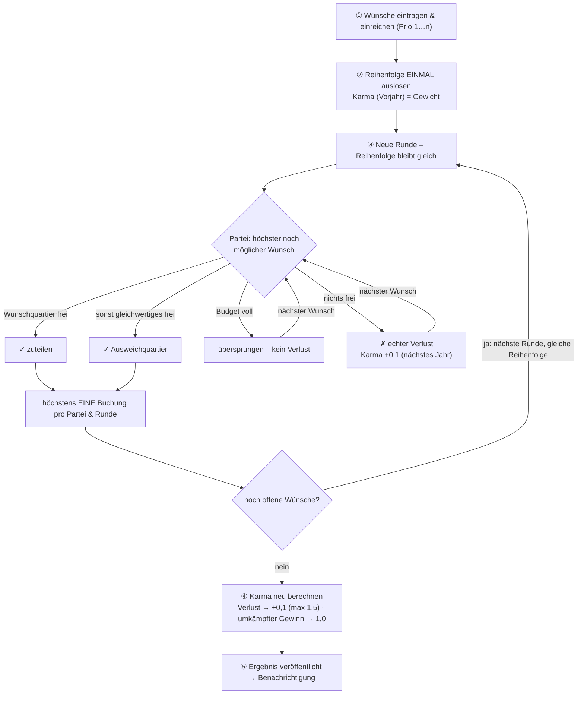

# Re:Hof Quartier-Buchung (PoC)

Buchungs- und Losverfahren für die Ferienquartiere der Genossenschaft, inklusive
Mitgliedermanagement. Diese PoC enthält das fachlich abgenommene Losverfahren als
getestetes, eigenständiges Python-Modul und eine schlanke Django-Oberfläche
darum herum.

> **Status:** lauffähige Proof-of-Concept. Der Losalgorithmus ist vollständig
> getestet (17 Tests, inkl. deterministischem Strategiesicherheits-Beweis).
> Oberfläche und Datenmodell decken den Kern ab; einige Komfort- und
> Verwaltungsfunktionen sind als Ausbaustufen vorgesehen (siehe unten).

---

## Schnellstart auf dem VPS

Voraussetzung: ein Linux-Server (Debian/Ubuntu), auf dem bereits **Caddy** läuft.
Docker/Compose/git werden vom Install-Skript bei Bedarf installiert.

```bash
git clone <dein-privates-repo> rehof
cd rehof

# 1) Voraussetzungen prüfen/installieren, .env mit Zufalls-Geheimnissen anlegen
./install.sh

# 2) In .env die Domain eintragen:
#    ALLOWED_HOSTS=quartiere.deine-domain.de
#    CSRF_TRUSTED_ORIGINS=https://quartiere.deine-domain.de

# 3) Stack bauen & starten (optional gleich mit Demo-Daten: --seed)
./install.sh --start
#   bzw.   ./install.sh --seed

# 4) Admin-Konto anlegen
docker compose exec web python manage.py createsuperuser
```

Danach den Caddy-Block aus `caddy/Caddyfile.snippet` in dein Host-Caddyfile
übernehmen (Domain anpassen) und Caddy neu laden:

```bash
sudo systemctl reload caddy
```

Caddy holt das TLS-Zertifikat automatisch und proxyt auf `127.0.0.1:8000`
(der Web-Container ist bewusst nur an localhost gebunden).

---

## Was die PoC kann

- **Mitgliedermanagement** über das Django-Admin (`/admin/`): Mitglieder,
  Ausgleichsfaktoren, Nächte-Budgets, Quartiere, Äquivalenzklassen.
- **Mein Kalender** (zentrale Mitglieder-Seite): Monatskalender mit den eigenen
  Buchungen und den **Berliner Schulferien**, verfügbare Tage, Buchen,
  **Stornieren**, und ein **Wunschlisten-Editor** fürs Losverfahren mit per
  Ziehen oder Pfeiltasten **verschiebbarer Priorität** und „In den Lostopf"-
  Bestätigung (vor dem Bestätigen nur für das Mitglied sichtbar).
- **Jahres-Losung** per Admin-Aktion: gewichtete Zufallsreihenfolge im
  Runden-Prinzip, Ausweichen auf gleichwertige Quartiere, Karma-Faktor für
  Verlierer, vollständiges Audit-Protokoll. Es nehmen nur **eingereichte**
  Wünsche teil.
- **Freigeschaltete Buchungszeiträume** (Admin): global für alle Quartiere und
  enger eingeschränkt für eine Teilmenge.
- **Buchungsregeln** (Admin): Mindestnächte, max. parallele Wohneinheiten und
  Aufenthaltsdeckel je Saison (siehe unten).
- **Tage an andere Mitglieder übertragen** (kein Übertrag ins Folgejahr).
- **Ergebnis- und Audit-Ansicht** mit nachvollziehbarem Ziehungsprotokoll.

Demo-Login nach `--seed`: Benutzername z.B. `anna0`, Passwort `demo12345`.
Die Losung wird im Admin unter **Buchungsperioden → Aktion „Losung durchführen"**
gestartet.

---

## Buchungszeiträume & Tage (Zeitlogik)

Die PoC unterscheidet bewusst zwei Zeitachsen:

- **Normale Buchung** ist nur in **freigeschalteten Buchungszeiträumen** möglich
  (üblicherweise das laufende Jahr). Der Admin legt diese unter
  **Buchungszeiträume** fest:
  - **global** (Haken „Gilt für alle Quartiere") – die Grundfreigabe, und
  - **enger für eine Teilmenge** – ein nicht-globales Fenster mit ausgewählten
    Quartieren schränkt deren Buchbarkeit weiter ein.
  - **Semantik (Schnittmenge):** Buchbar ist ein Tag nur, wenn er *sowohl*
    global *als auch* – falls für das Quartier ein spezifisches Fenster
    existiert – in diesem freigegeben ist. Spezifische Fenster können also nur
    weiter einschränken, nie über die globale Freigabe hinaus erweitern.
    (Beispiel im Seed: Pfarrhäuser nur Mai–September.)
- **Das Losverfahren** läuft typischerweise im Sommer für das **nächste Jahr**,
  dessen Buchungszeitraum noch **nicht** freigeschaltet ist. Es ist daher
  bewusst **unabhängig** von den Buchungszeiträumen und vergibt die Slots im
  Voraus.

**Verfügbare Tage:** Jedes Mitglied hat ein Jahreskontingent (Standard 50, davon
max. 25 über die Wunschliste/Losung). Tage werden **nicht** ins Folgejahr
übertragen – das Kontingent gilt je Kalenderjahr frisch. Tage können aber
**an andere Mitglieder übertragen** werden (Seite „Tage übertragen"); die
verfügbaren Tage ergeben sich aus Kontingent + erhaltene − abgegebene −
verbrauchte Tage.

---

## Buchungsregeln (im Admin konfigurierbar)

Zwei Admin-Bereiche steuern die Regeln; die Prüfung greift bei jeder normalen
Buchung:

- **Buchungsregel (global):** die Standard-Mindestbuchung (Default 3 Nächte).
- **Saison-Regeln:** beliebig viele Zeiträume mit je optional
  - **Mindestnächte** (z.B. Juli/August = 7),
  - **max. gleichzeitige Wohneinheiten** je Mitglied (z.B. Schulferien und
    Feiertage wie Weihnachten/Silvester, Ostern, Himmelfahrt, Pfingsten = 2),
  - **Aufenthaltsdeckel** je Partei in Einheiten-Nächten (z.B. Berlin/
    Brandenburg-Sommerferien = 14, also „zwei Wochen eine Einheit ODER eine
    Woche zwei Einheiten"). Die zwei Wochen müssen nicht am Stück liegen.

Außerhalb der hinterlegten Sonderzeiträume gibt es kein Parallel-Limit. Die
konkreten Termine (Schulferien, Brückentage, bewegliche Feiertage) verschieben
sich jährlich und werden im Admin gepflegt; der Seed legt die realen
Berlin/Brandenburg-Termine des laufenden Jahres als Startpunkt an (Berlin und
Brandenburg sind nahezu identisch).

> Hinweis: Diese Regeln werden bei der **normalen Buchung** geprüft. Für die
> **Losung** (die das Folgejahr im Voraus vergibt) sind sie als Ausbaustufe
> vorgesehen – die Prüflogik (`booking/rules.py`) ist bereits so gekapselt,
> dass sie sich dort einhängen lässt.

---

## Das Losverfahren in Kürze

Verfahren: **gewichtete Zufallsreihenfolge im Runden-Prinzip** (fachlich eine
„weighted random serial dictatorship" mit Ausweich-Logik und Mehrjahres-Ausgleich).

- **Reihenfolge – genau einmal:** Zu Beginn wird *eine* gewichtete Reihenfolge
  aller Teilnehmenden gezogen. Sie gilt für **alle Runden** und wird **nicht**
  jede Runde neu gezogen. Über einen Seed ist jede Ziehung reproduzierbar.
- **Karma als Gewicht:** Ein höherer Ausgleichsfaktor (aus früheren Verlusten)
  bringt in *dieser einen Ziehung* tendenziell einen vorderen Platz. Karma fließt
  also als **Gewicht in die Ziehung** ein – und wird **erst am Ende neu
  berechnet**, für die *nächste* Losung (nicht zwischen den Runden).
- **Runden-Prinzip:** In Runde 1 bekommt jede Partei – in der gelosten Reihenfolge
  – ihren *höchsten noch möglichen* Wunsch, in Runde 2 mit *derselben* Reihenfolge
  den nächsten, usw. Pro Runde höchstens **eine** Buchung je Partei – so werden
  knappe Premium-Termine (z.B. Pfingsten) gleichmäßiger verteilt.
- **Ausweichen:** Ist das konkrete Wunschquartier belegt, wird ein
  **gleichwertiges** Quartier derselben Äquivalenzklasse zugeteilt, bevor ein
  echter Verlust entsteht.
- **Karma-Update (am Ende):** Wer einen Zeitraum *echt* verliert (in der ganzen
  Klasse nichts frei), bekommt für die nächste Losung +0,1 (gedeckelt 1,5). Wer
  einen *umkämpften* Slot gewinnt, wird auf 1,0 zurückgesetzt. Budget-bedingtes
  Aussetzen zählt **nicht** als Verlust.
- **Strategiesicher:** Die Wunschliste bestimmt nur, *was* man nimmt, wenn man
  dran ist – nicht *wann*. Ehrliches Angeben ist nachweislich nie schlechter als
  Tricksen (siehe Test `test_strategieproof_ueber_alle_reihenfolgen`).

### Ablauf



### Beispiel: 5 Mitglieder, je 2 Wünsche

*Salix* und *Lupulus* sind **gleichwertig** (Gruppe „Gartenhäuser“), das
*Pfarrhaus* steht allein. Begehrt: **Pfingsten** (3 Nächte) und eine
**Sommerwoche** (7 Nächte). **Karma vorab:** Dora 1,2 (ging letztes Jahr leer
aus), alle anderen 1,0.

| Mitglied | ① Erstwunsch        | ② Zweitwunsch        |
|----------|---------------------|----------------------|
| Anna     | Salix · Pfingsten   | Pfarrhaus · Sommer   |
| Ben      | Lupulus · Pfingsten | Salix · Sommer       |
| Cem      | Salix · Pfingsten   | Pfarrhaus · Sommer   |
| Dora     | Pfarrhaus · Pfingsten | Salix · Sommer     |
| Eva      | Salix · Pfingsten   | Lupulus · Pfingsten  |

Dank Karma landet Dora wahrscheinlich vorn. Angenommen, die (eine!) Ziehung
ergibt **Dora ▸ Anna ▸ Ben ▸ Cem ▸ Eva**.

**Runde 1** – höchster noch möglicher Wunsch je Partei:
- **Dora** → Pfarrhaus · Pfingsten ✓ (kein anderer will Pfarrhaus zu Pfingsten → nicht umkämpft)
- **Anna** → Salix · Pfingsten ✓ (umkämpft)
- **Ben** → Lupulus · Pfingsten ✓ (umkämpft)
- **Cem** → Salix & Lupulus belegt → *Verlust*; Zweitwunsch Pfarrhaus · Sommer ✓ (umkämpft mit Anna)
- **Eva** → Salix & Lupulus belegt → *Verlust*; Zweitwunsch Lupulus · Pfingsten ebenfalls belegt → *Verlust*; keine Buchung

**Runde 2** – gleiche Reihenfolge; nur Dora, Anna, Ben haben offene Wünsche:
- **Dora** → Salix · Sommer ✓ (umkämpft mit Ben)
- **Anna** → Pfarrhaus · Sommer belegt (Cem) → *Verlust*
- **Ben** → Salix · Sommer belegt (Dora) → Ausweich **Lupulus · Sommer** ✓

**Ergebnis & neues Karma** (fürs *nächste* Jahr):

| Mitglied | Bekommen                                   | Karma neu                                  |
|----------|--------------------------------------------|--------------------------------------------|
| Anna     | Salix · Pfingsten                          | 1,0 → **1,1** (Verlust Sommer)             |
| Ben      | Lupulus · Pfingsten + Lupulus · Sommer     | 1,0 (umkämpft gewonnen)                    |
| Cem      | Pfarrhaus · Sommer                         | 1,0 → **1,1** (Verlust Pfingsten)          |
| Dora     | Pfarrhaus · Pfingsten + Salix · Sommer     | 1,2 → **1,0** (umkämpft gewonnen → Reset)  |
| Eva      | — (leer ausgegangen)                       | 1,0 → **1,1** (Verlust)                     |

Eva geht dieses Jahr leer aus, bekommt aber +0,1 Karma und damit nächstes Jahr
eine bessere Ausgangsposition; Dora hat ihren Vorsprung „eingelöst“ und startet
wieder bei 1,0. So bleibt es über die Jahre fair.

Das Verfahren ist im Detail in `Losverfahren-Spezifikation.md` beschrieben
(Genossenschafts-Vorlage und Bauplan zugleich).

---

## Tests

Zwei Ebenen:

```bash
# 1) Reine Logik (Losverfahren + Buchungszeiträume/Tage + Saison-Regeln) – ohne DB
pip install pytest
PYTHONPATH=. python -m pytest tests/ -v          # -> 41 passed

# 2) Integrationstests (DB-Ebene: Gate, Übertragung, Regeln, Kalender, Losung)
python manage.py test booking                    # -> 22 passed
```

Abgedeckt: Determinismus, Budget, Ausweich-Logik, Karma (Bonus/Deckel/Reset),
Pfingst-Stresstest, Fairness-über-die-Zeit, der deterministische
Strategiesicherheits-Beweis, die Schnittmengen-Semantik der Buchungszeiträume,
die Tage-Übertragung, die Saison-Regeln, Stornierung, Wunschlisten-Einreichung
(Lostopf) und Umsortierung, sowie die Unabhängigkeit der Losung von den
Buchungszeiträumen.

Die **Berliner Schulferien** (Anzeige im Kalender) liegen als eigenes Modell vor
und werden vom Seed mit den realen Terminen 2026/2027 gefüllt; sie sind im Admin
unter „Schulferien" pflegbar und beeinflussen die Buchungsregeln nicht (die
liegen in den Saison-Regeln).

---

## Verzeichnisstruktur

```
rehof/
├── install.sh                 # Voraussetzungen prüfen/installieren, .env, Start
├── docker-compose.yml         # web (Gunicorn) + db (PostgreSQL)
├── Dockerfile / entrypoint.sh # Image-Bau, Migrationen, optional Seed, Gunicorn
├── .env.example               # Vorlage; install.sh erzeugt daraus die .env
├── caddy/Caddyfile.snippet    # Block für das Host-Caddyfile
├── requirements.txt
├── manage.py
├── config/                    # Django-Projekt (settings, urls, wsgi)
├── booking/                   # die App
│   ├── lottery.py             # >>> Herzstück: reines Losverfahren <<<
│   ├── availability.py        # reine Logik: Buchungszeiträume + Tage-Rechnung
│   ├── rules.py               # reine Logik: Mindestnächte/Parallel/Deckel
│   ├── services.py            # Brücke DB <-> Logik, Buchung, Übertragung
│   ├── models.py              # Mitglied, Quartier, Periode, Wunsch, Zuteilung,
│   │                          #   Buchungszeitraum, Tage-Übertragung, Regeln …
│   ├── admin.py               # Mitgliedermanagement + Losung + Regeln + Fenster
│   ├── views.py / urls.py / forms.py
│   ├── templates/             # schlanke Oberfläche
│   ├── tests.py               # Django-Integrationstests (DB-Ebene)
│   └── management/commands/seed_demo.py   # Demo-Daten (echte Quartiere/Termine)
└── tests/                     # reine pytest-Suite
    ├── test_lottery.py        # Losverfahren / Fairness-Nachweis
    ├── test_availability.py   # Buchungszeiträume + Tage
    └── test_rules.py          # Mindestnächte / Parallel-Limit / Deckel
```

---

## Quartiere & Äquivalenzklassen

Die zehn echten Quartiere sind im Seed (`seed_demo.py`) hinterlegt. Die
**Äquivalenzklassen** (welche Quartiere als gleichwertig gelten und gegeneinander
getauscht werden dürfen) sind dort ein **Vorschlag** und in der Genossenschaft
abzustimmen – es ist eine Wert-Entscheidung, keine technische. Aktuell
vorgeschlagen:

| Klasse        | Quartiere |
|---------------|-----------|
| Gartenhaus    | Salix, Lupulus, Spinosa |
| Pfarrhaus     | Pfarrhaus Nord, Pfarrhaus Süd |
| Klein-Stall   | Stallgebäude Süd, Stallgebäude West |
| Groß-Stall    | Stallgebäude Nord |
| Mittel        | Scheunen Studio, Hofgebäude |

Anpassen im Admin (Äquivalenzklassen + Quartiere) oder in `seed_demo.py`.

---

## Sicherheit

- Django-Standard-Auth mit ordentlich gehashten Passwörtern, CSRF-Schutz,
  sichere Cookies in Produktion (`DEBUG=0`).
- TLS terminiert Caddy; der Web-Container ist nur an `127.0.0.1` gebunden.
- `install.sh` erzeugt einen langen zufälligen `SECRET_KEY` und ein DB-Passwort;
  die `.env` ist `.gitignore`-geschützt.
- **Authentifizierungs-Naht:** Für später ist ein Wechsel auf Keycloak/OIDC
  vorgesehen (z.B. `mozilla-django-oidc`), ohne die übrige App umzubauen – die
  Stelle ist in `config/settings.py` markiert.
- Wenn die App vollständig über HTTPS läuft, in `.env`
  `SECURE_HSTS_SECONDS=31536000` setzen.

---

## Ausblick (Ausbaustufen)

Umgesetzt sind Losverfahren, Buchungszeiträume (global + Teilmenge), normale
Buchung mit verfügbaren Tagen und die Tage-Übertragung an Mitglieder. Offen
bzw. als Feinschliff denkbar:

- Dienste & Waren (Endreinigung, Sauna) als buchbare Posten.
- Externe Buchungen sicher ausbauen (Modell-Flag vorhanden).
- Benachrichtigungen (E-Mail) zu Anmeldeschluss und Losergebnis.
- Kalender-/Belegungsansicht grafisch statt als Lückenliste.
